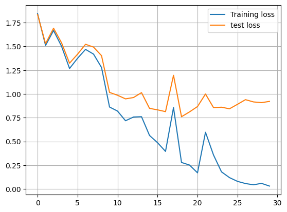
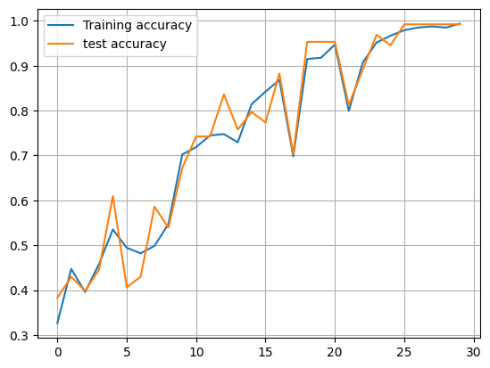
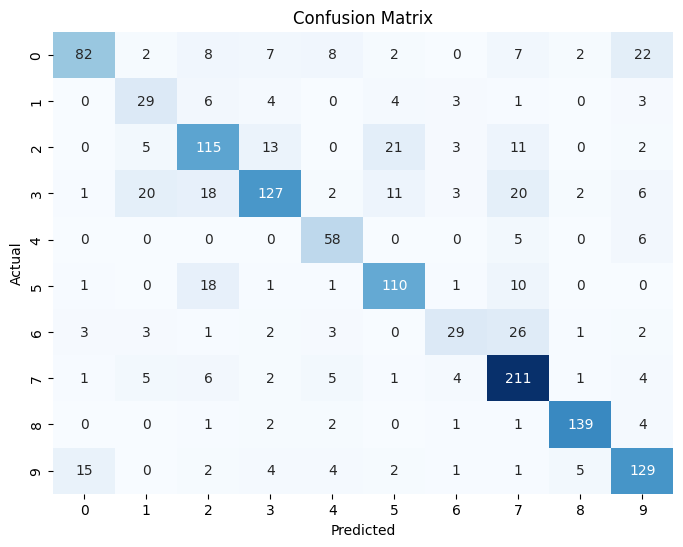
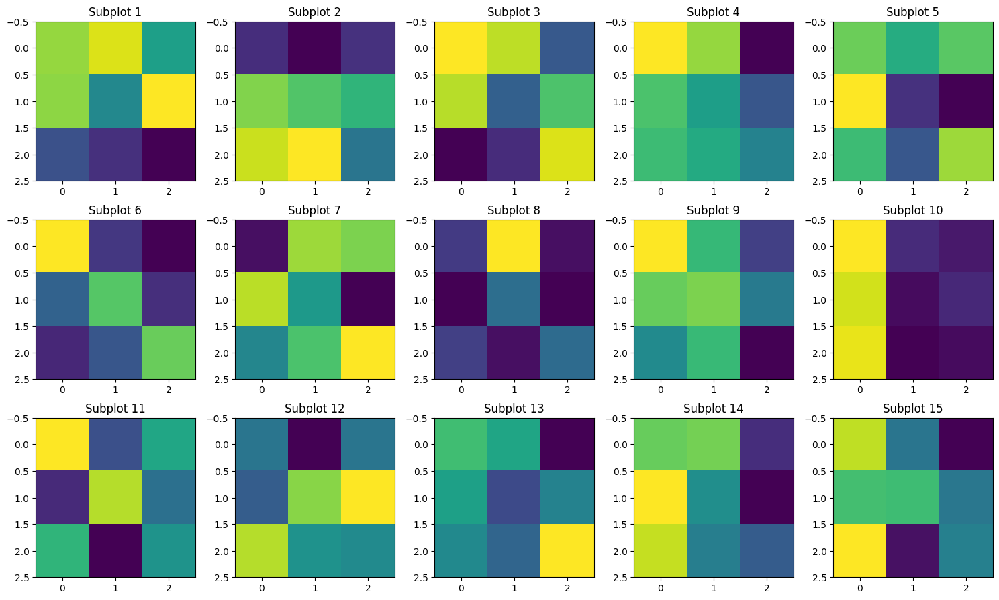
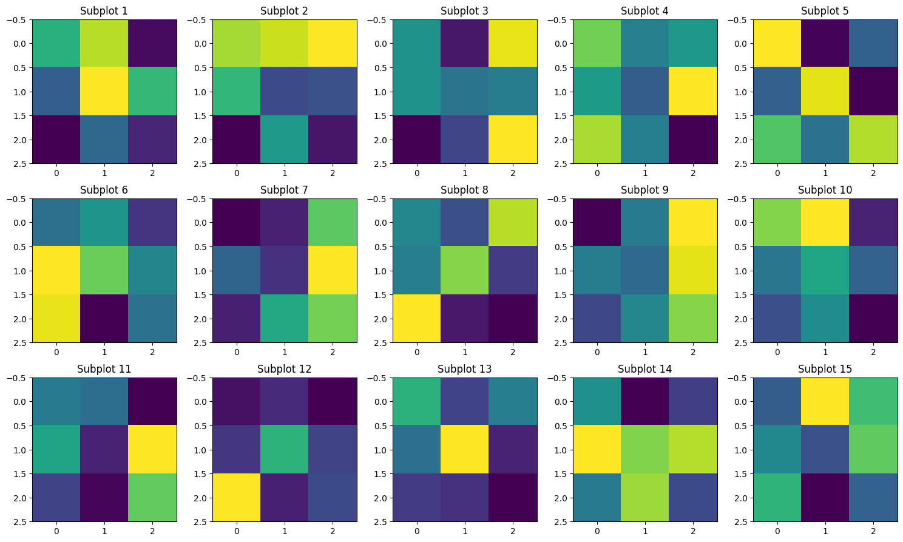
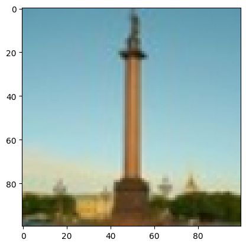
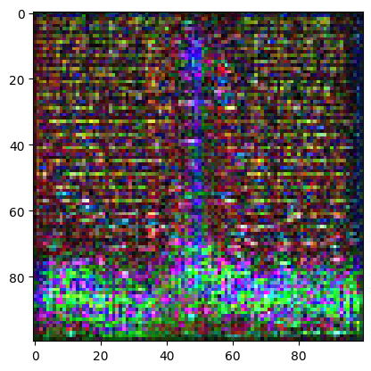

## Abstract
This project focuses on the classification of architectural heritage elements using Convolutional Neural Networks (CNNs). We employed the *Architectural Heritage Elements Image64 Dataset* consisting of 10,235 labeled images across ten architectural categories. The objectives are threefold: (1) train and evaluate a CNN model for image classification, (2) perform deconvolution visualization to interpret the CNN’s learned features, and (3) implement image generation for specific classes using deconvolution techniques. The model achieved a validation accuracy of up to **99.2%**, demonstrating strong classification performance. Furthermore, visualization of kernels and feature maps provided valuable insights into the CNN's decision-making process.

---

## 1. Introduction
Architectural heritage preservation plays a significant role in cultural conservation. Automated recognition of architectural components can assist experts in restoration and documentation. Deep learning models, particularly CNNs, are well-suited for visual tasks such as classification and feature extraction.  
The dataset used here — *Architectural Heritage Elements Image64* — includes **10,235 images** classified into **10 categories** (altar, apse, bell tower, column, dome (inner/outer), flying buttress, gargoyle, stained glass, and vault).  
This project aims to:
1. Train a CNN model for classification.
2. Use **deconvolution** to visualize what the CNN “sees.”
3. Generate images corresponding to specific classes.

---

## 2. Dataset
The dataset contains:
- **829** Altar
- **514** Apse
- **1059** Bell tower
- **1919** Column
- **616** Dome (inner)
- **1177** Dome (outer)
- **407** Flying buttress
- **1571** Gargoyle (and Chimera)
- **1033** Stained glass
- **1110** Vault  

---

## 3. Methodology

### 3.1 Data Preprocessing
- Images resized to **100×100 pixels**.  
- Data augmentation: random horizontal flips.  
- Normalization applied with mean `[0.485, 0.456, 0.406]` and std `[0.229, 0.224, 0.225]`.  
- Split: training, validation, and test sets using stratified partitioning.  

---

### 3.2 CNN Model Architecture
Two CNN architectures were implemented:
1. **Baseline CNN with AdaptiveAvgPool2d** (for classification).  
2. **CNN without AdaptiveAvgPool2d** (for deconvolution and reconstruction).  

Key components:
- **Convolutional layers** (3×3 kernel, padding=1).  
- **ReLU** activations.  
- **MaxPooling layers** (2×2, stride=2).  
- **Fully connected layers** with Dropout to prevent overfitting.  

---

### 3.3 Training Setup
- Optimizer: **SGD** with learning rate `0.1`.  
- Loss: **CrossEntropyLoss**.  
- Epochs: **30**.  
- Random seed: **42**.  

---

## 4. Results

### 4.1 Training & Validation Performance
- Training loss decreased from ~1.8 → 0.6.  
- Test loss decreased from ~1.8 → 0.8.  
- Training accuracy increased from ~0.30 → >0.80.  
- Validation accuracy reached up to **0.992**.  

<div align="center">

### 🔹 Line plots of training/test loss and accuracy




</div>

---

### 4.2 Confusion Matrix & Classification Report
The CNN produced high per-class performance, with only minor misclassifications in visually similar categories (e.g., inner vs. outer domes).  

<div align="center">

### 🔹 Confusion Matrix Heatmap


</div>

```
Classification Report:
              precision    recall  f1-score   support

         0.0       0.80      0.59      0.67       140
         1.0       0.45      0.58      0.51        50
         2.0       0.66      0.68      0.67       170
         3.0       0.78      0.60      0.68       210
         4.0       0.70      0.84      0.76        69
         5.0       0.73      0.77      0.75       142
         6.0       0.64      0.41      0.50        70
         7.0       0.72      0.88      0.79       240
         8.0       0.93      0.93      0.93       150
         9.0       0.72      0.79      0.76       163

    accuracy                           0.73      1404
   macro avg       0.71      0.71      0.70      1404
weighted avg       0.74      0.73      0.73      1404
```

---

### 4.3 Kernel Visualization
Convolutional kernels from the first and second layers were extracted and visualized.  
- Early kernels focus on edge detection.  
- Deeper kernels generalize more abstract patterns.

<div align="center">

### 🔹 Grid of convolutional kernels from first and deeper layers




</div>

---

### 4.4 Deconvolution Visualization
Deconvolution was applied to reconstruct input images and visualize activations.  
- Yellow-highlighted areas correspond to the most significant regions used by the CNN for classification.  


<div align="center">

### 🔹 Deconvolution Visualization




</div>

---

## 5. Discussion
The CNN achieved excellent classification results with a validation accuracy close to 99%. This demonstrates the effectiveness of deep CNNs even with relatively simple architectures when combined with preprocessing and augmentation.  
The **deconvolution visualizations** confirmed that the model attends to meaningful architectural features (arches, edges, patterns), aligning with human perception. However, overlap in dome categories remains challenging.

---

## 6. Conclusion
This study successfully trained and evaluated a CNN for classifying architectural heritage elements. Beyond classification, the work demonstrates **interpretability** via kernel visualization and **generative potential** through deconvolution-based image reconstruction.  
Such methods can aid in digital heritage preservation, providing both recognition and deeper interpretability.

---

## 7. Future Work
- Employ more advanced optimizers (Adam, RMSProp).  
- Experiment with deeper networks or transfer learning (e.g., ResNet, VGG).  
- Extend deconvolution experiments across all categories.  
- Apply the pipeline to larger and more diverse architectural datasets.

---

## References
- Architectural Heritage Elements Image64 Dataset.  
- PyTorch Documentation: https://pytorch.org/docs/stable/  
- Zeiler, M. D., & Fergus, R. (2014). *Visualizing and Understanding Convolutional Networks*. ECCV.  

